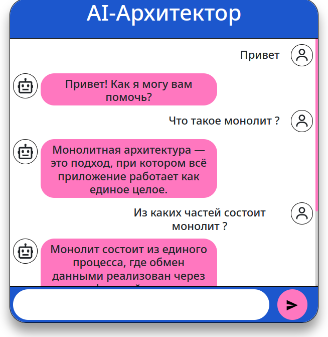

# Проектная работа. Спринт 5

Для запуска чат-бота соберем и запустим

```shell
docker compose build && docker compose down -v && docker compose up -d
```

Лог с дебагом вывода rasa в файле [rasa.log](rasa.log)

Пример как это выглядит в приложении

